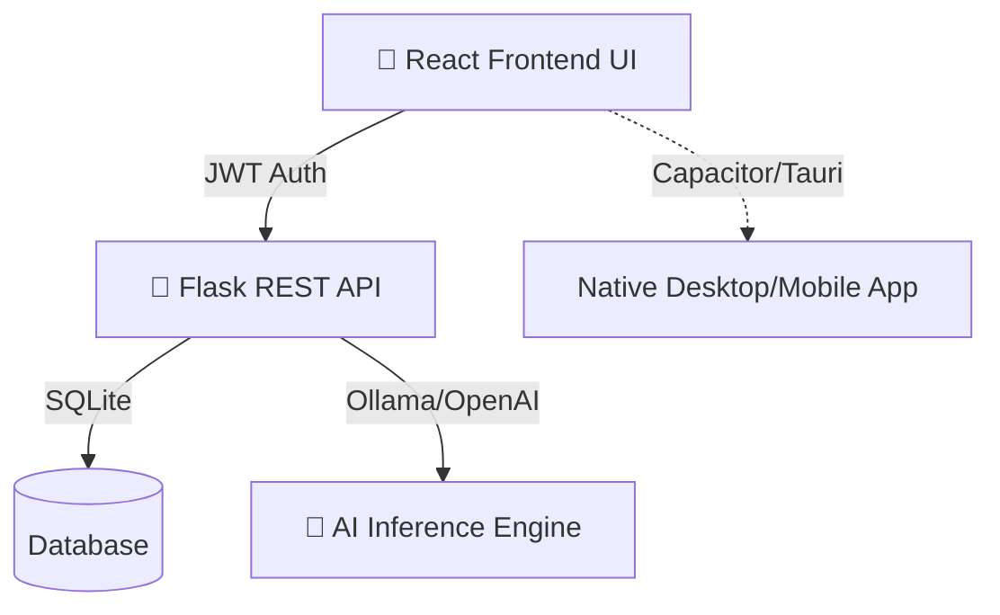

<div align="center">
  <h1>🧠 MetaScreener</h1>
  <p>An AI-powered systematic review and meta-analysis screening tool.</p>
  
  [](https://github.com/abusuraihsakhri/MetaScreener/actions)
  [](https://reactjs.org/)
  [](https://flask.palletsprojects.com/)
  [](https://tailwindcss.com/)
</div>

---

## 🎯 Overview

MetaScreener accelerates the literature review process by providing a modern, cross-platform interface for importing papers, identifying duplicates, and leveraging AI models (such as local Ollama, OpenAI, or Anthropic) for title and abstract screening.

## 🏗️ Architecture



- **Frontend (`MetaScreener_UI`):** A responsive, cross-platform Single Page Application (SPA) built with React, TypeScript, Vite, and Tailwind CSS.
- **Backend (`MetaScreener_Web`):** A secure Python Flask REST API handling data processing, deduplication, and AI inference.

## ✨ Key Features

- 📥 **Import & Deduplication:** Upload RIS/CSV files and seamlessly merge exact duplicate papers.
- 🤖 **AI-Assisted Screening:** Connect to local or cloud-based LLMs to drastically reduce manual screening time while maintaining high recall.
- 📊 **PRISMA Flow Tracking:** Automatically generates and tracks PRISMA flowchart data.
- 💻 **Cross-Platform Ready:** The decoupled architecture allows the UI to be wrapped for Desktop (Tauri/Electron) or Mobile (Capacitor) easily.

## 🚀 Getting Started

### 1. Start the API Backend
```bash
cd MetaScreener_Web
pip install -r requirements.txt
export ADMIN_PASSWORD="your_secure_password"
python app.py
```
> [!IMPORTANT]
> Ensure you have set the `ADMIN_PASSWORD` environment variable. The app will refuse to start without it to ensure your API remains secure!

### 2. Start the Frontend UI
```bash
cd MetaScreener_UI
npm install
npm run dev
```

## ⚙️ Continuous Integration / Deployment

This repository includes pre-configured GitHub Actions:
- **Pages Deploy (`pages.yml`):** Automatically builds and deploys the React frontend to GitHub Pages upon pushing to the `main/master` branch. 
- **Automated Releases (`release.yml`):** Automatically creates clean `.zip` artifacts of the UI and Backend whenever a new version tag (e.g., `v1.0.0`) is pushed to the repository.

> [!NOTE]
> If your GitHub Pages deploy fails with a 404 error, you must navigate to **Settings > Pages** in your GitHub repository and set the source to **GitHub Actions**.
